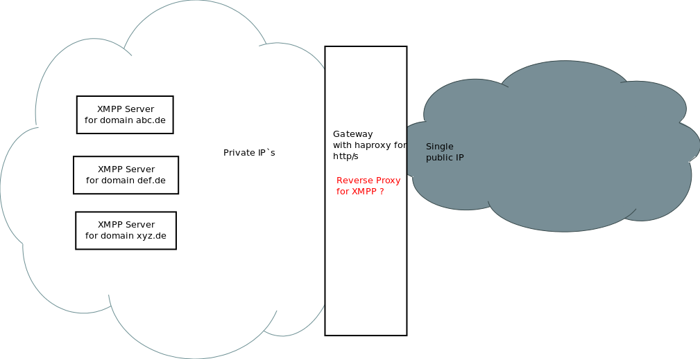

# This is a XMPP reverse proxy

## What for i need this

If you have multiply XMPP (Extensible Messaging and Presence Protocol) chat server in your intranet.
But only one public ip. You need to decide by domain of xmpp handshake where to send traffic to.



## Compile depends

First, i need some librarys with other licence, so you will need to compile this software by your own.

The easyest way is to use ant

https://ant.apache.org/

or on ubuntu

`apt-get install openjdk-7-jre ant openssl`

To download the depends you need ivy

http://ant.apache.org/ivy/

http://superuser.com/questions/452192/how-to-install-ant-ivy


## How to compile

Run on your console

```bash
ant resolve
ant compile
ant jar
```

to get your  `build/jar/xmpp-proxy.jar`

## Configuration

Place an ini filewhere ever you want.

This file should contain

```ini
[domains]
example.de = 192.168.10.123
a.example.com = 192.168.10.124:5222
b.example.com = 192.168.10.124:5222
```

Just a list of domains an the local targets.

You can give a port or not.
But default it will use the same port as where the proxy is listen on.

## Running

`java -jar /opt/xmpp-proxy.jar --port=5222 --ssl_port=5223 --ssl_cert=/etc/ssl/your.domain.pem --config=/etc/xmpp.ini`

### Startscript

In the contribute folder you will find `supervisor` config.

http://supervisord.org/

`apt-get install supervisor`

In contrast to a normal start script, it will restart the server in case of a crash.

### Parameter

You hava 4 Parameter

port | The plain text xmpp port. Should be 5222
config | The path to the ini file. This fill will check all 3 sec for modification an reloadet if required
ssl_port | The optional port for crypted xmpp connections. Should be 5223
ssl_cert | Only required if ssl_port was set. Should be a x509 file, Including private key and cert.

### Logging

This software logs to console and syslog.

`rsyslogd` and `lograte` config files can be found in `contribute` folder.

### SSL / XMPPS

The proxy use a x509 pem file like apache or haproxy.
It will create a new temporary java keysstore on start.

For this are commands `openssl` and `keytool` required.
For windows users: They need to be within your $PATH variable.

You need to restart the server if the pem file changed.

## Licence

GNU GPL

